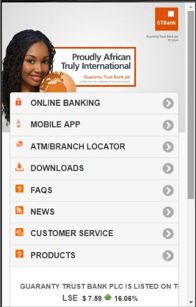

# Bank

Bank is a frontend redesign of the GTBank home page.

The homepage of GTBank website is indeed very beautiful, i was very impressed with the way the designers/developers were able to conceal large chunk of information and links. The homepage design is simple yet very appealing, i thinks users will not have a hard time locating information on the website.

However, I observed that Gtbank website lacks responsiveness; the main website is not adaptive to changes in screen size (the main website has no breakpoints). The bank have a different website for mobile users, but still the design of the mobile site looks poor and very slow. Being a big fan of responsive designs, I developed a responsive frontend that could adapt to different sizes of screen. 

The goal was to design and develop a responsive layout that masks information when the homepage is viewed on a mobile device; at the same time ensuring that there isn’t going to be much compromise on the amount of information that can be accessed on a smaller screen when compared with what is obtainable on a larger screen.

This was what the bank's mobile site looked like- 

**_(Update)_** Between the time of my observation and when i commenced on redesigning the frontend of the homepage, GTBank had already re-designed to make the website more responsive. However, despite these new changes it is still not as good as you would expect from a top organisation.

### View ScreenShots
*  [The Home page](images/GTBank_home.png "GTBank Home page")
* [My design ](images/my_design.png "My Design")
*  **_(Update)_** The new GTBank website with added responsiveness - 

    [Mobile homepage](images/GTBank_mobile_new1.png "GTBank New Mobile homepage")
    
    [Mobile menu](images/GTBank_mobile_new2.png "GTBank New Mobile menu")

### Technologies
* HTML5
* CSS3
* JQUERY

### Tools and Resources
[Fullscreen slider by Nikolay Talanov](https://codepen.io/suez/pen/ByvKXE "Fullscreen drag-slider with parallax")

